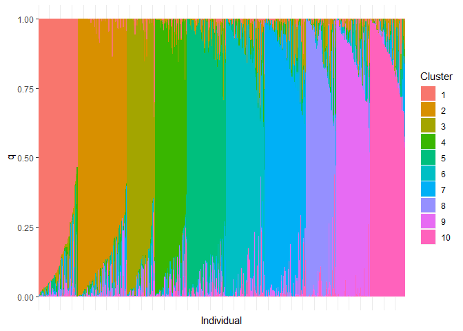
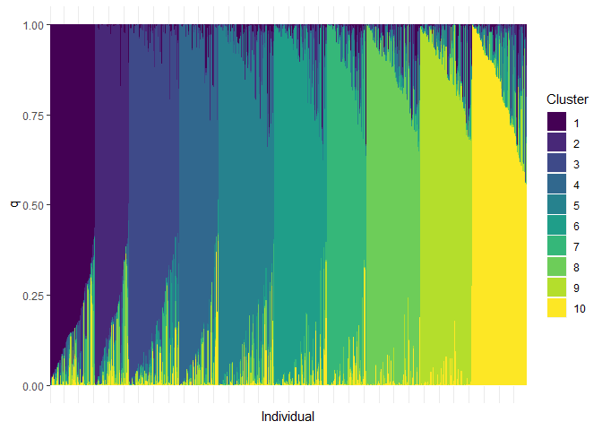
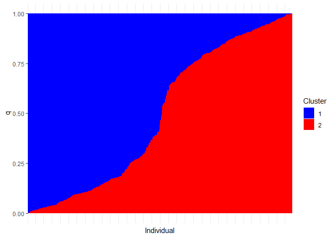

<!-- README.md is generated from README.Rmd. Please edit that file -->

# plotGenStruct

<!-- badges: start -->

[](https://travis-ci.com/aj2duncan/plotGenStruct)
<!-- badges: end -->

The goal of plotGenStruct is to assist with plotting clustered genetic
STRUCTURE datasets using the [ggplot2](https://ggplot2.tidyverse.org/)
package. Data is automatically sorted into clusters and several palettes
can be easily chosen.

## Installation

At present the package can only be installed from github with:

``` r
# install.packages("devtools")
devtools::install_github("aj2duncan/plotGenStruct")
```

## Plotting Data

Existing STRUCTURE data can be plotted using the function
`struc_plot()`. If you don’t have any data to hand then some random data
can be generated using the `create_sruc_data()` function

This is a basic example which shows you how to solve a common problem:

``` r
library(plotGenStruct)
create_struc_data()
# A tibble: 5,000 x 3
   Individual Cluster      q
   <chr>        <int>  <dbl>
 1 Ex101            1 0.063 
 2 Ex101            2 0.014 
 3 Ex101            3 0.0048
 4 Ex101            4 0.016 
 5 Ex101            5 0.183 
 6 Ex101            6 0.022 
 7 Ex101            7 0.007 
 8 Ex101            8 0.006 
 9 Ex101            9 0.008 
10 Ex101           10 0.676 
# ... with 4,990 more rows
```

To see what the reordered data looks like we can use `struc_reorder()`.

``` r
struc_reorder(create_struc_data())
# A tibble: 5,000 x 4
   Individual Cluster     q main_cluster
   <chr>        <int> <dbl>        <int>
 1 Ex154            1 0.999            1
 2 Ex219            1 0.997            1
 3 Ex403            1 0.997            1
 4 Ex537            1 0.987            1
 5 Ex581            1 0.987            1
 6 Ex394            1 0.986            1
 7 Ex316            1 0.980            1
 8 Ex234            1 0.957            1
 9 Ex184            1 0.955            1
10 Ex152            1 0.953            1
# ... with 4,990 more rows
```

Finally we can plot the data.

``` r
struc_plot(create_struc_data())
```



### Different Palettes

You can also specify different palettes which is just a short cut to
several of the `scale_fill_*()` functions from
[ggplot2](https://ggplot2.tidyverse.org/).

``` r
struc_plot(create_struc_data(), fill_pal = "viridis")
```



This includes a custom palette. Here we also specify only two clusters.

``` r
# custom palette
struc_plot(create_struc_data(num_clusters = 2), 
           fill_pal = "custom", values = c("blue", "red"))
```


